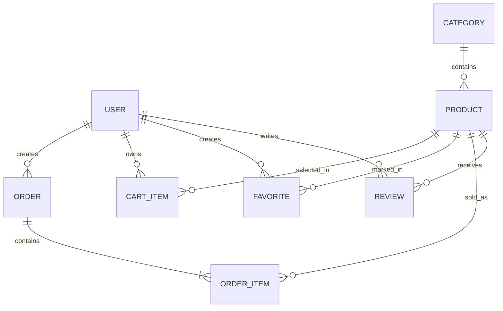

# Лабораторная работа 1 Проектирование базы данных

## Цель

Спроектировать структуру данных интернет-магазина конструкторов «КубКубыч», достаточную для каталога, покупки, отзывов и администрирования.

## Предметная область и роли

Покупатель просматривает наборы, добавляет их в избранное и корзину, оформляет заказ и после доставки оставляет отзыв. Администратор управляет сериями и наборами, обрабатывает заказы, модерирует отзывы и меняет настройки магазина. Эти роли реализованы пользовательской моделью `users.User` и её полем роли.

## Анализ аналогов

| Аналог | URL | Наблюдаемые возможности | Что учтено в проекте |
| --- | --- | --- | --- |
| LEGO | https://www.lego.com/en-us/categories/sets | Каталог наборов, тематические серии, карточка набора, поиск и фильтрация | `Category`, `Product`, фильтры каталога, карточка по slug |
| Brickset | https://brickset.com/sets | Поиск наборов, классификация по темам, отображение характеристик | Артикул, серия, возрастной диапазон, число деталей, цена и остаток в `Product` |

Аналитический вывод: оба аналога подтверждают необходимость отдельных сущностей серии и набора, а также отбора каталога по характеристикам. Корзина, заказ, избранное и отзыв добавлены как процессы интернет-магазина.

## Логическая модель

| Сущность | Назначение | Ключевые связи |
| --- | --- | --- |
| `User` | покупатель или администратор | 1:N с заказами, корзиной, избранным и отзывами |
| `Category` | серия конструкторов | 1:N с `Product` |
| `Product` | карточка набора | N:1 с серией; N:M с пользователями через `Favorite`; N:M с заказами через `OrderItem` |
| `Favorite` | отметка избранного | связывает один `User` и один `Product`; уникальная пара |
| `CartItem` | позиция корзины | связывает один `User` и один `Product`; уникальная пара |
| `Order` | заказ и его состояние | N:1 с `User`; 1:N с `OrderItem` |
| `OrderItem` | снимок позиции при покупке | связывает `Order` и `Product`; хранит цену и название на момент заказа |
| `Review` | оценка и текст отзыва | N:1 с пользователем и набором |
| `SiteSetting` | единые настройки витрины | одиночная запись без пользовательской связи |

Во всех основных транзакционных сущностях используются временные метки создания и/или изменения. Для изображений предусмотрены `Category.image` и `Product.image`; для документации набора — `Product.specification_file`.

## ER-диаграмма

## Проверка и доказательства

1. Открыть модели и показать как минимум шесть таблиц из перечня выше.
2. Показать `OrderItem`: это промежуточная сущность связи N:M между заказом и набором.
3. Показать `Favorite`: это промежуточная сущность связи N:M между пользователем и набором.
4. Сделать скриншоты страниц двух аналогов, ER-диаграммы и фрагментов моделей.

## Открытая часть перед сдачей

- [ ] Вставить реальные скриншоты аналогов.
- [ ] При необходимости перенести Mermaid-диаграмму в формат, требуемый преподавателем.
- [ ] Добавить титульный лист по шаблону СДО.
